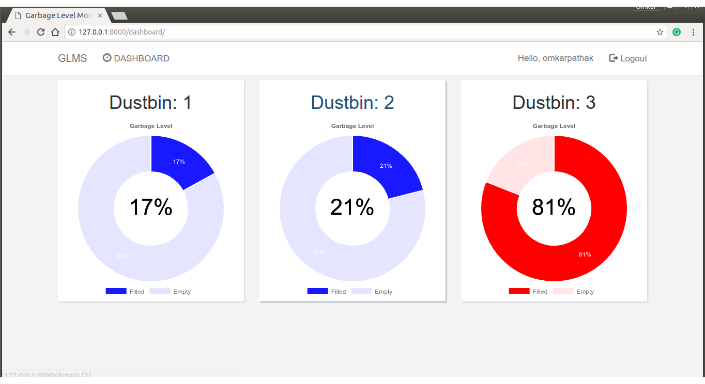
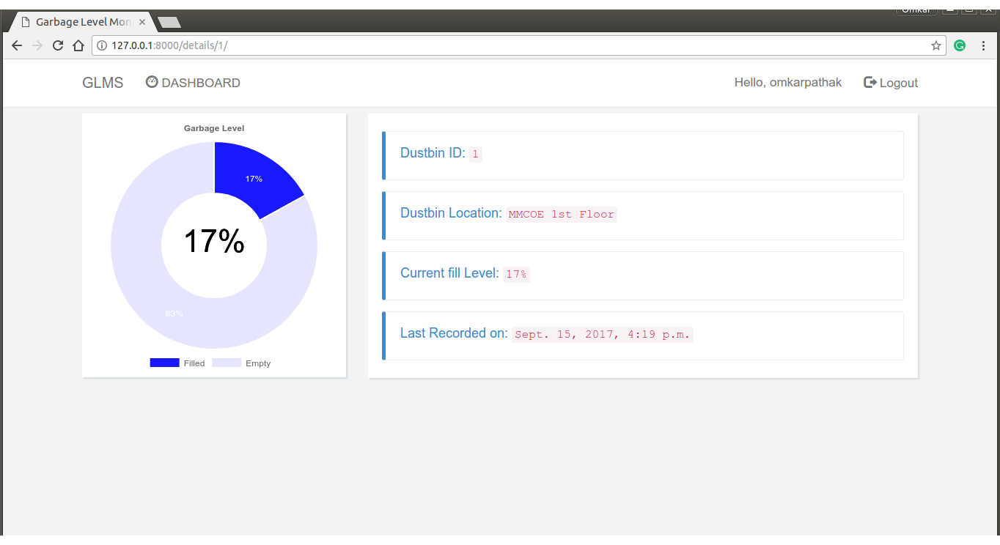

# Garbage-Level-Monitoring-System
My BE Project using IoT, Cloud and Django

# Results

Global Dashboard Provided to monitor garbage levels in real-time

 

Getting more information after clicking on a specific garbage bin icon on dashboard

